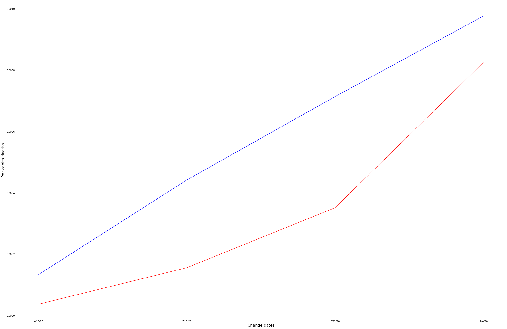

# Association Between County Political Leaning and Covid Deaths
## By William Frame
This project explores the relationship between county Covid-19 deaths and county voting preferences in the 2016 election. This project is largely motivated by the claim that more conservative regions of the country fared worse in the pandemic and that this was best explained by the differences in views regarding lockdowns and mask wearing between democrats and republicans. 
The main findings of this study was mainly that, while there was evidence of an association between county voting preference and county Covid deaths, it was small and it was associated positively with an excess of Clinton voters, not Trump voters in a county. It also appears that at no point in the pandemic did the average county with an excess of Trump voters fare worse than the average county with an excess of Clinton voters. This can be seen in the below graphs:

Below is a time series (at the increment of days) showing total US Covid deaths since the pandemic began:
 

And here we see the time series for per capita deaths in red and blue counties since the pandemic began:
 
